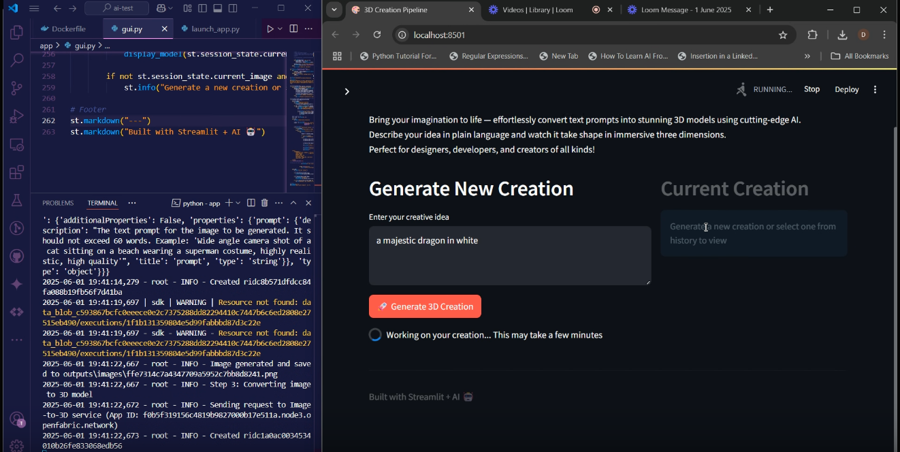

# 🛠️ 3D Creation Pipeline - AI-Powered Text to 3D Model Generator

Transform your imagination into interactive 3D models using AI. This powerful pipeline takes your text prompt, enhances it using a local language model, generates a stunning image, and converts it into a 3D model—all while storing your creative journey.

---

## ✨ Features

- **Text-to-3D Generation**: Convert your creative ideas into 3D assets
- **Prompt Refinement with Local LLM**: Enhances input using OllamaLlama for optimized visual output
- **Session & Persistent Memory**: Track and revisit all your creations
- **Interactive Streamlit UI**: Clean, intuitive interface for seamless interaction
- **Smart Memory System**: Stores prompts, images, and 3D models for future reference

---

## 🏗️ System Architecture

```
User Prompt → Local LLM → Text-to-Image → Image-to-3D → Memory Database
```

**Components**:
- 🧠 Local LLM: `OllamaLlama` for enhanced prompt engineering  
- 🎨 Openfabric Apps: Text-to-Image and Image-to-3D conversion  
- 🗃️ SQLite: Persistent long-term memory  
- 📺 Streamlit: User interface

---

## 📸 Sample Output

Below are example screenshots from the application:




---

## 🛠️ Installation & Setup

### Prerequisites
- Python 3.8+
- [Poetry](https://python-poetry.org/)
- Openfabric SDK
- Streamlit

### Installation Steps

```bash
cd app
python3 -m venv venv
poetry install
pip install openfabric_pysdk-0.3.0-py3-none-any.whl
pip uninstall python-magic
pip install python-magic-bin
# Activate environment
.env\Scriptsctivate        # On Windows
# source venv/bin/activate    # On Unix/MacOS
```

---

## 🚀 Running the App

```bash
python launch_app.py
```

Then navigate to: [http://localhost:8501](http://localhost:8501)

---

## 🧠 Memory System

### 1. Short-Term (Session-Based)
- Recent prompt
- Last generated image
- Last created 3D model

### 2. Long-Term (Persistent)
- Raw and enhanced prompts
- Image and model file paths
- Tag metadata

All stored in `memory.db` (SQLite).

---

## 🧪 Example Workflow

1. Input prompt: `"A futuristic knight standing atop a neon-lit skyscraper."`
2. Click **Create 3D Model**
3. System automatically:
   - Enhances the prompt
   - Generates an image
   - Converts the image into a 3D model
4. Preview/download the output or revisit later via the sidebar.

---

## 🧩 Project Structure

```
app/
├── app.py                     # UI with Streamlit
├── launch_app.py              # Entry point
├── main.py                    # Backend logic
├── core/
│   ├── llm/ollama_llama.py    # Local LLM integration
│   ├── memory/memory_manager.py  # Memory logic
│   ├── pipeline/generator.py  # Core creative pipeline
│   └── stub.py                # Openfabric API stub
├── outputs/
│   ├── images/                # Generated images
│   └── models/                # Generated 3D models
└── memory.db                  # SQLite DB
```

---

## 🧠 Future Enhancements

- 🎙️ Voice-controlled prompts
- 🔍 FAISS/ChromaDB: Semantic prompt matching
- 🎛️ Interactive 3D viewer controls
- 📦 Batch processing mode
- 🎨 AI style transfer for 3D assets

---

## 🛠️ Troubleshooting

| Issue | Solution |
|-------|----------|
| 3D Model not visible | Download and open in a dedicated 3D viewer |
| Image generation failed | Use concise and meaningful prompts |
| Launch issues | Verify Openfabric services and network configs |

---

> 🚀 Bring your ideas to life with just a few words.
